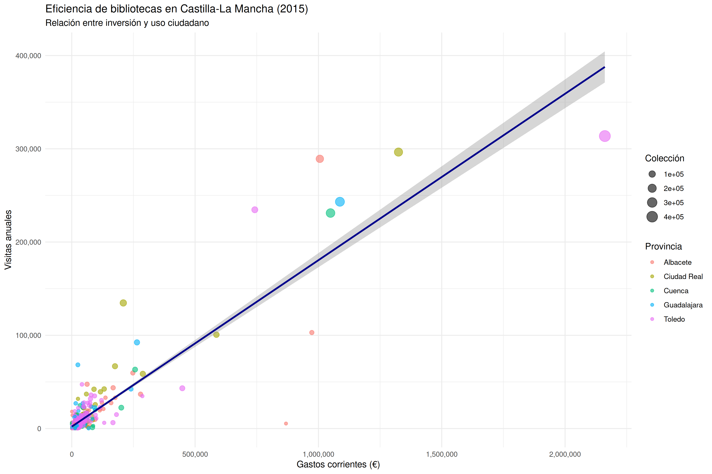

# Práctica 2: Diseño y elaboración de una visualización estadística

## 📁 Archivo

- **Nombre:** `VisAct2Material.xlsx`
- **Ubicación:** `/home/patricio/github/Informes-Bibliometricos/UC3M`
- **Hoja:** `InformeAnualPorBiblioteca`

---

## 🔧 Código R

### 1. Instalación (solo primera vez)

```r
install.packages(c("readxl", "dplyr", "ggplot2"))
```

### 2. Lectura de datos

```r
library(readxl)
library(dplyr)
library(ggplot2)

# Leer archivo
bibliotecas <- read_excel(
  "/home/patricio/github/Informes-Bibliometricos/UC3M/VisAct2Material.xlsx",
  sheet = "InformeAnualPorBiblioteca"
)

# Ver datos
glimpse(bibliotecas)
head(bibliotecas)
```

### 3. Limpieza

```r
# Renombrar y limpiar
bibliotecas <- bibliotecas %>%
  rename(
    nombre = `Nombre biblioteca`,
    municipio = Muncipio,
    provincia = Provincia,
    coleccion = Colección,
    visitas = Visitas,
    usuarios = `Usuarios inscritos`,
    prestatarios = `Prestatarios activos`,
    personal = `Personal ETC.`,
    actividades = `Actividades culturales`,
    gastos = `Gastos corrientes`
  ) %>%
  filter(!is.na(visitas), !is.na(gastos), gastos > 0)

# Variable derivada
bibliotecas <- bibliotecas %>%
  mutate(eficiencia = (visitas / gastos) * 1000)
```

### 4. Visualización principal

```r
# Gráfico de dispersión
ggplot(bibliotecas, aes(x = gastos, y = visitas)) +
  geom_point(aes(size = coleccion, color = provincia), alpha = 0.6) +
  geom_smooth(method = "lm", se = TRUE, color = "darkblue") +
  scale_x_continuous(labels = scales::comma) +
  scale_y_continuous(labels = scales::comma) +
  labs(
    title = "Eficiencia de bibliotecas en Castilla-La Mancha (2015)",
    subtitle = "Relación entre inversión y uso ciudadano",
    x = "Gastos corrientes (€)",
    y = "Visitas anuales",
    size = "Colección",
    color = "Provincia"
  ) +
  theme_minimal()

# Guardar
ggsave("/home/patricio/github/Informes-Bibliometricos/UC3M/grafico_bibliotecas.png", 
       width = 12, height = 8, dpi = 300)
```

### 5. Estadísticas clave

```r
# Correlación
cor(bibliotecas$gastos, bibliotecas$visitas)

# Top 5 más eficientes
bibliotecas %>%
  arrange(desc(eficiencia)) %>%
  select(nombre, visitas, gastos, eficiencia) %>%
  head(5)
```

---

## Resultados

### Gráfico



### Correlación

| Biblioteca | Visitas | Gastos | Eficiencia |
|-----------|---------|--------|------------|
| Biblioteca del Silo del Conocimiento | 18,222 | 482 | 37,805 |
| Biblioteca Pública Municipal de Agramón | 6,455 | 482 | 13,392 |
| Biblioteca Pública Municipal de Cuenca 'Villa Román' | 5,955 | 482 | 12,355 |
| Biblioteca Pública Municipal de Cuenca 'Fuente del Oro' | 4,615 | 482 | 9,575 |
| Biblioteca Pública Municipal de Calypofado | 2,722 | 482 | 5,647 |

---
